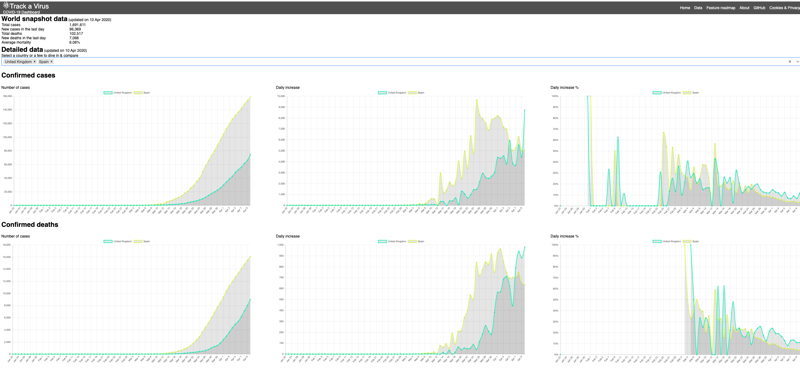

# Track a Virus: COVID-19 Dashboard

Track a Virus is a dashboard for analysing COVID-19 data across the globe. Its key features are:

- Comparison between different countries
- Ability to see daily changes in a number of cases and deaths
- Snapshot of the data across the whole world
- Our ambition is to provide the most comprehensive COVID-19 dashboard, so your code contributions are more than welcome :-)

Currently, it uses [the data provided by the John Hopkins university](https://github.com/CSSEGISandData/COVID-19). It's updated daily.

# Project is open for contributors

This is an open-source project for a reason. We want to build the most comprehensive COVID-19 dashboard. And it's a big task that will be impossible without help from people from all around the world.

Moreover, the project has [a prioritised roadmap](https://github.com/mikeborozdin/track-a-virus/projects/1). So if you think of working on a feature, there's already a whole list of ideas.

We also welcome your ideas and bug reports. So, please, do file them in [the Issues section](https://github.com/mikeborozdin/track-a-virus/issues).

Interesting in contributing? Awesome :-). Check the [Contributing section](./CONTRIBUTING.md).

# Tech Stack

Key technologies are:

- React
- TypeScript
- MobX
- Chart.js
- Jest
- Native CSS grids
- Interested in more tech topics, check the Check the [Contributing section](./CONTRIBUTING.md).

# Running locally

- `npm start` - starts the dev server
- `npm run builds` - runs all pre-build checks and builds a production version
- `npm test` - runs all the unit tests
- `npm run test:coverage` - all tests + coverage information
- `npm run lint` - TypeScript type checks and linting by eslint
- `npm run prettier` - running Prettier (code formatting checks)
